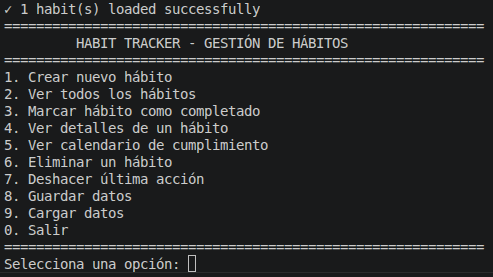
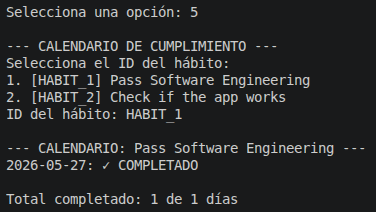
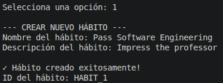
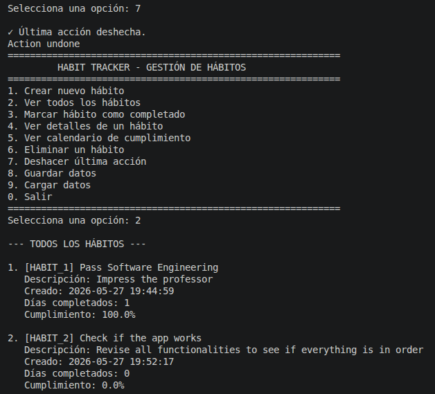
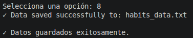
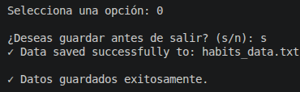
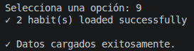

# Habit Tracker

## Prompts used to generate the app

1. Build a pipeline of the steps you would follow to implement an app called HabitTracker in C++ with the user stories contained in user_stories.md 

2. Follow your pipeline step by step, implementing the app in the folder LAB06

3. Generate detailed and clear documentation about the app you implemented

4. Each time a new habit is created it overwrittes the one that already exists. Fix the error without affecting the existing functionalities.

## Screenshots of the final app

## Lessons learned in this practice

We have learnt that copilot is a really powerful tool that can be very useful if used correctly. Still, we need to formulate specific and efficient prompts and revise everything it implements.

It's important to test each functionality, since we almost overlook that each time we created a new habit it replaced the already existing one.